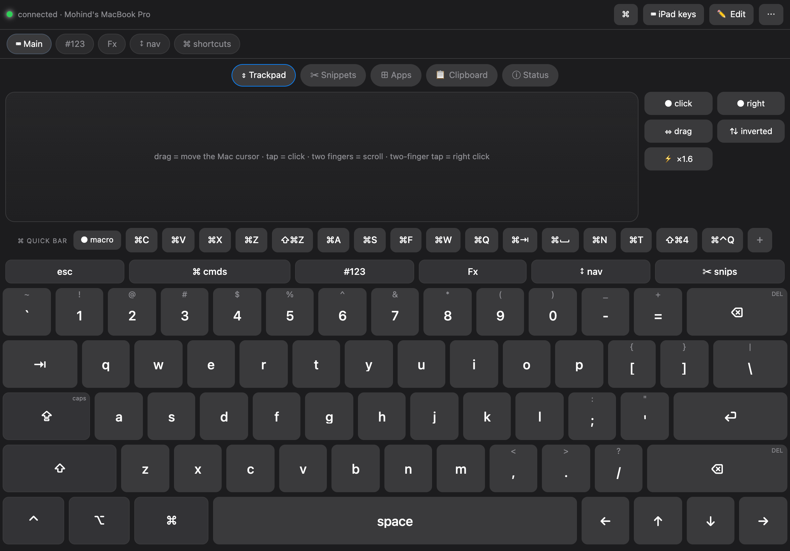

# MacSpace

Turn your iPad Pro into a keyboard, trackpad and remote control for your Mac.
You design the layout, the colours and the buttons; what you tap on the iPad
lands on the Mac as real keystrokes, cursor movement and clicks.

```
iPad (Safari / Home Screen app)  --Wi-Fi-->  Mac (Swift helper)  -->  real input events
        your custom layout                       plain HTTP + token, LAN only
```

MacSpace's keyboard, mouse, clipboard, and application-control traffic stays on your local network. The optional Buy Me a Coffee button loads from a third-party CDN. No MacSpace account or cloud service is required.



---


## Security and privacy

MacSpace is a local-network HTTP bridge. It can inject keyboard and mouse events, read and write the Mac clipboard, list running applications, and focus applications when requested. Use it only on a trusted network; do not expose port `8787` to the internet. The access token in the URL should be treated like a password.

See [SECURITY.md](SECURITY.md) and [PRIVACY.md](PRIVACY.md) for details.

## 1. Start it on the Mac

```bash
git clone https://github.com/mohindpa/MacSpace.git
cd MacSpace
./build.sh      # compile (one time, ~10s)
./run.sh        # start it, prints the URL for the iPad
```

`run.sh` prints something like:

```
Open in Safari on your iPad:  http://<your-mac-ip>:8787/?t=<token>
```

Stop it with `./stop.sh`.

> **Why run.sh stages a copy:** this project lives inside `Documents`, which macOS
> protects with TCC. An app launched by LaunchServices that touches `Documents`
> stops on a consent dialog, and MacSpace reads its token at startup — so it would
> hang before serving anything. `run.sh` therefore copies `web/` and the token into
> `~/Library/Application Support/MacSpace/` and runs from there. Edit the source
> here, then re-run `./run.sh` to publish the change.

## 2. One-time: let the Mac accept the input

macOS only lets an app type on your behalf if you allow it:

**System Settings → Privacy & Security → Accessibility → enable “MacSpace”**

`./grant-accessibility.sh` opens that exact pane for you. MacSpace already asks
for it on first launch; the checkmark stays off until you tick it.

You can always see the current state at `http://<mac-ip>:8787/health` (`"ax": true`
means typing will work), and the iPad shows a red banner if it is off.

## 3. Open it on the iPad

Type the URL from step 1 into Safari on the iPad, then:

**Share → Add to Home Screen** → it opens fullscreen like a real app, no Safari bars.

---

## Using it

| Action | How |
|---|---|
| Type a key | tap it — it types on press, like a real keyboard |
| **Hold a key** | hold any character, digit, space, ⏎, arrow or ⌫ → it **repeats** (420 ms delay, then ~18/s, like macOS). Holding ⌫ deletes continuously; holding ← walks the cursor |
| Sticky modifier | tap ⇧ ⌥ ⌃ ⌘ once → it lights up, applies to the next key |
| **Hold a modifier** | hold ⇧ ⌥ ⌃ ⌘ → it is **really held** while your finger is down (like a physical key: hold ⌘ then tap C = copy), and releases when you lift |
| Lock a modifier | tap it **twice** → stays on (good for long runs of ⌘-shortcuts); tap once to release |
| Switch layout | tap the tabs: `⌨ Main`, `#123`, `Fx`, `↕ nav`, `⌘ cmds` |
| Main layer | full QWERTY like the iPad Pro's own: number row (with ⌫), `⇥ Q…P [ ] \`, `⇪ A…L ; ' ⏎`, `⇧ Z…M , . / ⌫`, then `⌃ ⌥ ⌘ space ← ↑ ↓ →`. Every row is exactly 15 key-units wide, so the columns line up like a real keyboard |
| Backspace | two of them — top right (Mac position) and right of the Z row (iPad position) |
| ⇪ Caps Lock | real position: leading the A row. Tap toggles it on the **Mac** (the key lights up green-ringed), tap again to release |
| Letter case | letter keys show their live case — lowercase normally, **uppercase** when ⇧ is armed/locked or Caps Lock is on, exactly what the Mac will type. It re-syncs from the Mac, so pressing Caps Lock on the physical keyboard updates the iPad too |
| Quick bar | the shortcut shelf sitting above the keys: `⌘C ⌘V ⌘X ⌘Z ⇧⌘Z ⌘A ⌘S ⌘F ⌘W ⌘Q ⌘⇥ ⌘␣ ⌘N ⌘T ⇧⌘4 ⌘⌃Q` — one tap fires the combo on the Mac |
| Build a quick button | tap **＋** on the quick bar (or long-press any chip to edit it). A chip can be a **keyboard shortcut** (key + modifier chips) or a **text snippet** it types/pastes for you |
| Record a macro | tap **● macro**, perform the sequence, tap **■ stop**, name it → it becomes a chip. Tapping it replays the whole sequence (30 ms apart) |
| Hide the quick bar | header **⌘** button, or **⋯ → ⌘ Quick bar: on/off** |
| **⇕ Trackpad** | drag anywhere on the pad = move the Mac cursor · quick tap = left click · two-finger drag = scroll · two-finger tap = right click. Buttons: `● click`, `● right`, `⇔ drag` (drag-lock for drag & drop), `⇅` scroll direction, `⚡ ×1.6` pointer speed |
| **⊞ Apps** | every app running on your Mac with its real icon — tap one to bring it to the front |
| **📋 Clipboard** | shows what's on the Mac's clipboard right now; `⤓ to iPad`, `⤒ send iPad copy`, `⌘V paste on Mac`, or type text and `↑ set Mac clipboard` / `↑ set + paste` |
| **ⓘ Status** | Mac battery + charging, bridge version, round-trip latency, Accessibility state, app count, uptime, cursor position |
| Type prose / dictate | header **⌨︎ iPad keys** → use the native iPad keyboard (autocorrect, emoji, 🎤 dictation) and it streams to the Mac |
| ✂︎ Snippets | saved blocks of text — your email, a sign-off, an address. The `✂︎ snips` key on the keyboard opens the **panel** (the keyboard stays visible); one tap types the text on the Mac. Over 40 characters it's pasted via the clipboard instead. `＋ snippet` to add, long-press a card to edit or delete |
| Edit a key | header **✏️ Edit**, then tap a key. Or just long-press any key (works without edit mode) |

### Editing keys

The key sheet gives you: label, small top-right label, **symbol above the key**
(that's what puts `!` over `1`), action type (send a key / sticky modifier /
type text / switch layer), the key or symbol, modifier chips, width, style, and
**custom colours for that key**.

`✏️ Edit` also reveals per-row **＋** buttons, an **＋ row** button, **＋ layer**,
duplicate layout, and **export / import** (JSON — paste it anywhere to back up).

### Theme & colours

**⋯ → 🎨 Theme**: 6 presets (Graphite, Midnight blue, Paper light, Terminal green,
High contrast, WebsiteSpa blue) plus 11 colour pickers (including **Press glow**)
and 5 sliders: **key height**, **press pulse speed**, corner radius, key gap and
label size. Everything repaints live, and your theme is saved on the iPad and is
included in export/import.

Pressing a key shows a **fast pulse stroke** — a glowing ring around the key
(160 ms by default) rather than a solid fill, so the key's own colour stays
readable. Tune it with the *Press pulse speed* slider (60–500 ms) and recolour it
with *Press glow*; armed modifiers keep a soft standing glow so you can see ⌘ is
locked on.

**Key height** is expressed as a multiple of key width, so `1.0` = true keyboard
proportions (square keys, like the iPad's own on-screen keyboard). Raise it to
1.3–1.6 if you want taller keys in portrait and don't mind the stretch.

---

## Is there an app that already does this?

Short answer: yes, several — but none gives you a layout *you* design plus full
colour control without a subscription. What exists:

| App | What it does | Why it isn't this |
|---|---|---|
| **Remote Mouse** (free + IAP) | iPad as mouse/keyboard over Wi-Fi | Fixed layouts, no layout designer |
| **Mobile Mouse** ($9.99 / BT version) | same, plus native-Bluetooth mode | No custom layouts; paid |
| **BT Keys** | real Bluetooth-HID keyboard/trackpad | Needs the app on the Mac too; pair-wise quirks |
| **Air Keyboard for iPad** | has a layout designer | ~2014-era stack, update checker errors on modern macOS |
| **Custom Keypad** ($4.99, 2011) | custom keypads | Requires a VNC server; very old |
| **Apple Universal Control / Sidecar** | Mac keyboard → iPad | **Wrong direction**: it drives the iPad from the Mac |

So: if you just want *any* keyboard, buy Remote Mouse. If you want *your* layout,
*your* colours and one-tap snippets with no subscription, this build is the answer.

## Why this can't be a plain Bluetooth keyboard

iPadOS does not let third-party apps act as a generic Bluetooth HID keyboard
peripheral for a Mac (no such public API), and Apple's own features only push the
Mac's keyboard *into* the iPad. The reliable path is what we built: the iPad talks
to a small helper on the Mac over your Wi-Fi, and the helper injects real
CoreGraphics keyboard events — which is exactly how the App Store apps do it too.

---

## Files

```
<project>/                  (the cloned MacSpace repository)
├── src/main.swift        the Mac side (HTTP server + keyboard/mouse injection)
├── web/index.html        the whole iPad app: layout engine, themes, editors, panels
├── build.sh              compiles build/MacSpace.app
├── run.sh / stop.sh      start / stop
├── grant-accessibility.sh
├── test-e2e.sh           types into a scratch TextEdit doc and checks the result
├── test-caps.sh          verifies Caps Lock toggling
├── server.log            log + the iPad URL   (git-ignored)
└── token                 access token (the ?t=… in the URL)   (git-ignored)
```

Security: the server listens on your LAN, every request needs the token, and the
token is stored in `token` (mode 0600-ish). Don't forward port 8787 to the
internet. Regenerate the token by deleting the file and restarting.

## HTTP API (if you want to build your own client)

```
GET  /health              → {ok, ax, host, port}              (no token needed)
GET  /status              → battery, caps, uptime, cursor, apps, version
GET  /ping                → {ok, ax, caps}                    (cheap, polled by the app)
GET  /?t=TOKEN            → the app itself

POST /key?t=TOKEN         {k:"a", m:["cmd"], d:"tap"|"down"|"up"}
                          {k:"capslock"}                      (toggles, returns the state)
POST /text?t=TOKEN        {s:"hello", mode:"type"|"paste"|"auto"}

POST /mouse?t=TOKEN       {t:"move",  dx:12, dy:-8}
                          {t:"click", btn:"left"|"right", n:2}
                          {t:"scroll", dx:0, dy:-40}
                          {t:"down"|"up", btn:"left"}          (drag)

GET  /apps?t=TOKEN        → running apps: pid, name, active, 48px icon (base64 PNG)
POST /focus?t=TOKEN       {pid: 1234}                          (bring app to front)

GET  /clipboard?t=TOKEN   → {text, length}                     (the Mac clipboard)
POST /clipboard?t=TOKEN   {s:"text", paste:false}              (set it; paste:true also hits ⌘V)
```

`k` accepts single characters or names: `return tab space delete forwarddelete
escape left right up down home end pageup pagedown f1…f20 cmd shift option control fn …`

## Troubleshooting

| Symptom | Fix |
|---|---|
| Red banner: "Mac has not granted Accessibility permission" | tick **MacSpace** in Accessibility (step 2) |
| iPad can't reach the URL | same Wi-Fi network? Mac awake? Use the `.local` URL if the IP changed: `http://<your-mac>.local:8787/?t=…` |
| "server not responding" | `./run.sh` (or `./stop.sh` then `./run.sh`) |
| Keys type in the wrong app | keystrokes go to whatever is **focused on the Mac** — that's how a keyboard behaves |
| It types nothing but the dot is green | Accessibility tick missing (see `/health`) |
| Caps Lock won't turn off | tap ⇪ again; the state is read back from the Mac, so the key follows reality |
| Trackpad scrolls the wrong way | tap **⇅** in the pad buttons (flips natural ↔ inverted) |
| Cursor too slow / too fast | tap **⚡ ×1.6** to cycle pointer speed (1.0 → 1.6 → 2.2) |
| The pad is cramped in landscape | the keyboard takes most of the height — lower **Key height** in 🎨 Theme, or use portrait |


## Contributing

Contributions are welcome. See [CONTRIBUTING.md](CONTRIBUTING.md) before opening an issue or pull request.

## License

MacSpace is available under the [MIT License](LICENSE).
